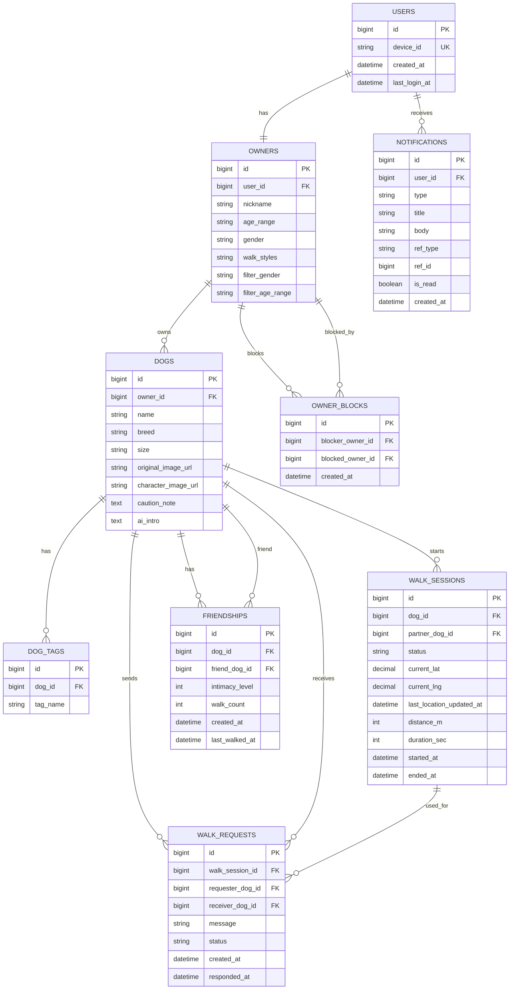

# PawMesh MVP ERD

```mermaid
erDiagram
    USERS ||--|| OWNERS : has
    OWNERS ||--o{ DOGS : owns
    OWNERS ||--o{ OWNER_BLOCKS : blocks
    OWNERS ||--o{ OWNER_BLOCKS : blocked_by

    DOGS ||--o{ DOG_TAGS : has
    DOGS ||--o{ WALK_SESSIONS : starts
    DOGS ||--o{ WALK_REQUESTS : sends
    DOGS ||--o{ WALK_REQUESTS : receives
    DOGS ||--o{ FRIENDSHIPS : has
    DOGS ||--o{ FRIENDSHIPS : friend

    WALK_SESSIONS ||--o{ WALK_REQUESTS : used_for
    USERS ||--o{ NOTIFICATIONS : receives

    USERS {
        bigint id PK
        string device_id UK
        datetime created_at
        datetime last_login_at
    }

    OWNERS {
        bigint id PK
        bigint user_id FK
        string nickname
        string age_range
        string gender
        string walk_styles
        string filter_gender
        string filter_age_range
    }

    OWNER_BLOCKS {
        bigint id PK
        bigint blocker_owner_id FK
        bigint blocked_owner_id FK
        datetime created_at
    }

    DOGS {
        bigint id PK
        bigint owner_id FK
        string name
        string breed
        string size
        string original_image_url
        string character_image_url
        text caution_note
        text ai_intro
    }

    DOG_TAGS {
        bigint id PK
        bigint dog_id FK
        string tag_name
    }

    WALK_SESSIONS {
        bigint id PK
        bigint dog_id FK
        bigint partner_dog_id FK
        string status
        decimal current_lat
        decimal current_lng
        datetime last_location_updated_at
        int distance_m
        int duration_sec
        datetime started_at
        datetime ended_at
    }

    WALK_REQUESTS {
        bigint id PK
        bigint walk_session_id FK
        bigint requester_dog_id FK
        bigint receiver_dog_id FK
        string message
        string status
        datetime created_at
        datetime responded_at
    }

    FRIENDSHIPS {
        bigint id PK
        bigint dog_id FK
        bigint friend_dog_id FK
        int intimacy_level
        int walk_count
        datetime created_at
        datetime last_walked_at
    }

    NOTIFICATIONS {
        bigint id PK
        bigint user_id FK
        string type
        string title
        string body
        string ref_type
        bigint ref_id
        boolean is_read
        datetime created_at
    }
```
